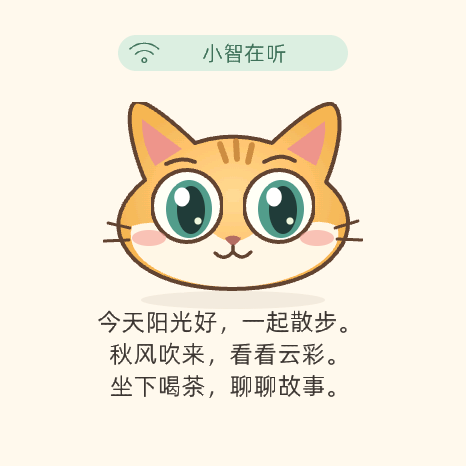

# 小智圆屏猫咪界面

按用户确认的奶橘猫设计适配 466×466 AMOLED。背景为暖白色，顶部 Wi-Fi 与状态文字分区排列，中间显示大眼奶橘猫，底部保留三行完整字幕。

## 使用

- 在设备桌面打开 AIChats / 小智应用即可看到新版界面。
- 小智原有唤醒和联网操作保持不变。
- 聆听时眼睛会偶尔左右看并眨眼；思考时抬眼、轻歪头；说话时嘴巴开合。
- 服务端情绪可以切换开心、好奇、困倦等表情。嘴型跟随“正在说话”状态，不是逐音素口型同步。
- 正文使用现有完整中文字库缩放到约24px，每页最多三行。超过一页时显示当前页数，每6秒翻到下一页。
- 轻点字幕区可立即翻页，末页后回到第一页，便于回看；屏幕边缘保留系统手势。
- 切换应用时暂停动画和自动翻页；重新进入恢复。退出时清理界面和定时器。

## 资源与构建

猫咪由静态底图和眼睛、嘴巴等小图层组成，RGB565A8 图像共275,748字节，不存储整屏动画序列。图片数组已纳入源码，正常构建不需要浏览器、Node或Python绘图库。

整机编译：

```sh
./tools/build-firmware.sh
```

主机测试使用同版本LVGL9.4和完整中文字体，检查文字高度、圆屏边界、分页、触摸、表情、动画和对象销毁，并导出实际控件画面：

```sh
cmake -S . -B build-native -DCMAKE_BUILD_TYPE=Release
cmake --build build-native -j8
ctest --test-dir build-native --output-on-failure
```

预览输出位于 `build-native/artifacts/xiaozhi-ui.ppm` 和 `xiaozhi-cat-*.ppm`。这些是固件控件的主机渲染截图，不是设备拍照。



仅在修改猫咪画稿后才需要运行 `tools/generate-cat-assets.py`。它使用Pillow以及Node/Playwright调用本机Google Chrome渲染SVG；Playwright从标准Node模块路径或 `XIAOZHI_PLAYWRIGHT_MODULE` 指定的模块路径加载。转换前后应运行猫咪测试并查看预览，防止SVG颜色或透明度丢失。

## 安装范围

在已经迁移到本项目分区表的设备上，只更新 `0x200000` 的应用镜像。烧录前重新保存并校验完整32MiB备份；烧录后核对新应用，并在启动前比较应用分区以外区域的摘要。NVS、语音模型、字体资源和内部媒体不参与写入。

## 本次验证（2026-09-28）

- 原有回归及新增界面测试共20项CTest全部通过。猫咪测试73项检查、字幕布局测试6,352项检查通过。
- 已独立审查布局、对象生命周期、分页、渲染资源和烧录流程。开心表情说话时嘴型不动的问题已修正并通过针对性回归。
- ESP-IDF5.5.5整机编译通过，应用6,534,416字节，8MiB应用分区剩1,854,192字节（约22%）。esptool镜像校验和及validation hash有效。
- 固件SHA256：`0259a89f67864c640eee2971880015aebcb01fd192a4b6bb99bdf5d47496d146`。
- 烧录前完整32MiB备份已独立核对设备端摘要。备份SHA256：`e3cb48b18316d533e22881db0449942bbedb5d0fddf21eaa1b52393ed7192d53`。
- 已将应用烧录到 `0x200000` 并通过回读摘要校验；重启前确认应用分区以外的两个Flash区域摘要与烧录前一致。
- 烧录后自动重启，约8秒出现 `Brookesia firmware is ready`，成功安装14个桌面应用；55秒串口观察期内未出现错误级日志或崩溃特征。
- 源码实现提交：`e6f0211`。本地镜像及构建记录位于 `artifacts/xiaozhi-cat-ui/`，私有设备备份和日志位于 `artifacts/device-runs/20260928-xiaozhi-cat/`。

主机测试和启动日志不能代替实机交互体验。设备上的触摸、实际字幕阅读、猫咪动画观感和语音对话仍需在设备上体验确认。
