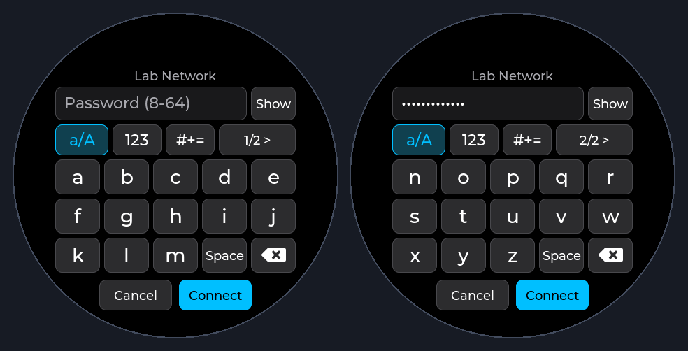

# 圆屏 Wi-Fi 大按键输入

用户选择：设置中的 Wi-Fi 密码键盘改为字母两页、每行 5 键，优先降低误触。

在 WLAN 页面上打开独立的密码输入层，展示网络名、单行密码、显隐按钮、模式与页码、3 行大键及底部取消/连接。466×466 屏上字符键目标 64×50 像素、字体 28 像素、间距 6 像素；所有交互控件位于半径 223 像素的安全圆内，兼容状态栏导致的页面顶部裁切。字母 A–M/N–Z 两页，大小写可切换；数字与符号另有页面，覆盖可打印 ASCII，空格和删除位置固定。

仅松手点击才输入一个字符，字符键不连发；滑出按键取消输入。模式切换不修改已有密码、不失焦关闭。密码默认隐藏，显隐可切换。普通密码接受 8–63 字符；64 字符必须为十六进制 PSK，完整传递给 ESP-IDF，不截断为 63 字符。不足 8 位或不合法的 64 位输入留在编辑器提示。取消、关闭应用和重新打开时清空编辑内容并恢复隐藏状态。连接仍由原有后台 Wi-Fi 任务执行，编辑器不访问网络或 NVS。

抽取为只依赖 LVGL 的 WifiPasswordKeyboard 类；WlanPage 只负责显示、取消、复制密码和发起既有连接状态。主机测试以真实 LVGL 指针事件覆盖输入、删除、大小写、分页、符号、显隐、长度边界、滑出取消、圆形安全区、重复创建销毁；生成界面图片用于视觉复核。ESP-IDF 完整构建后说明实机验证状态。

主机 LVGL 实际渲染预览（未绘制系统状态栏，外圈用于展示屏幕范围）：

